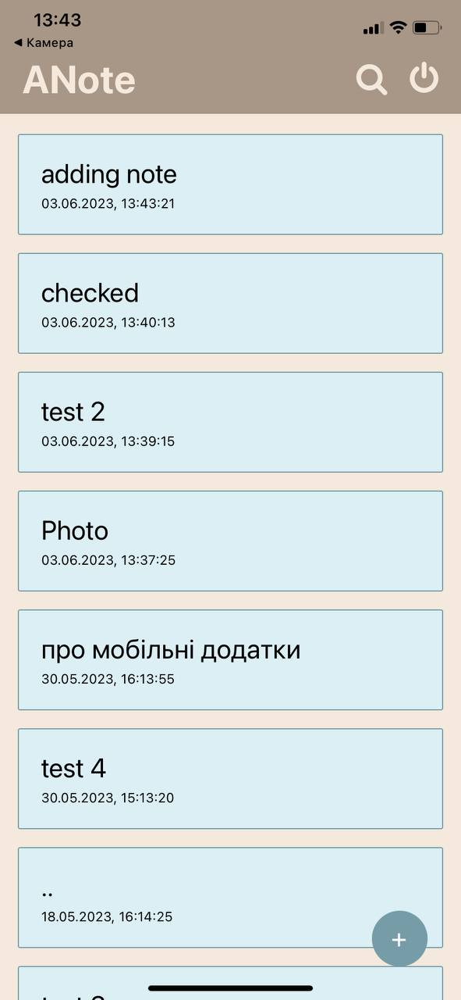
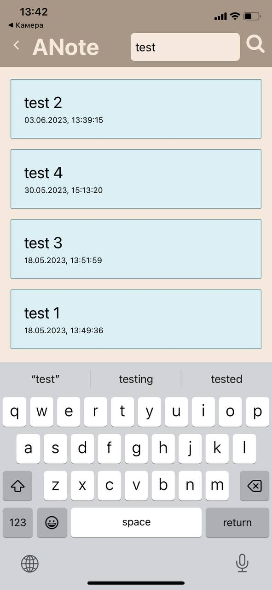
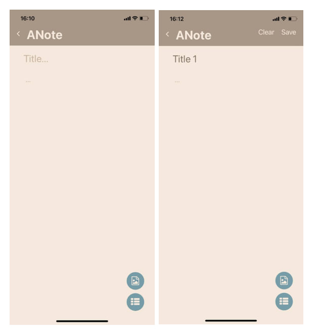

# ANote
Додаток "Нотатки".
___________________

Навігація між екранами реалізована в файлі navigate.js

Вхід користувача та реєстрація реалізовані в компоненті Authform.js

В компоненті MainDB.js реалізовано відображення списку нотаток

Компонента Form.js відоповідає за додавання нотатки та фото в базу даних, а також редагування.

Компонента ShowNote.js відповідає за відображення нотатки та видалення.

Компонента Search.js відповідає за пошук нотаток в БД та відображення знайдених нотаток на екран.

___________________

Екран авторизації та реєстрації:
____________________

_____________________

Екран відображення всіх нотаток: 

_____________________

Пошук нотаток:

  
______________________

Додавання нової нотатки (З можливістю додавання фото з галереї мобільного пристрою та додавання чекбоксів)

_______________________
Редагування існуючої нотатки

Відображення текстової нотатки (Нотатка може вирівнюватись по лівому/правому краю та по центру кнопками на верхній панелі)

______________________

Відображення нотатки з фото та чекбоксами

